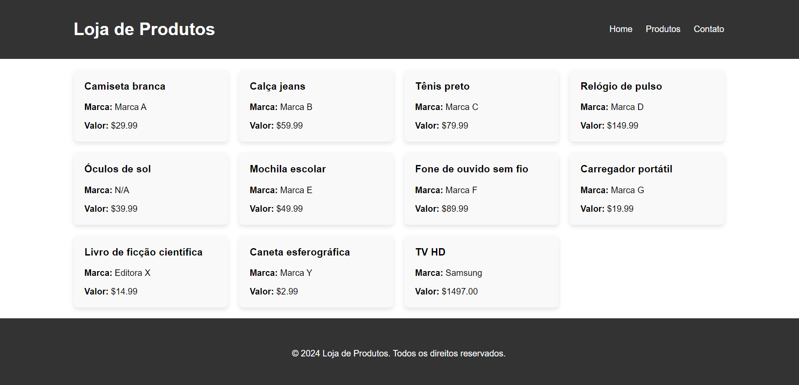

<h2>🌐Node.js and Express Website</h2>

---

<h3>📖Informations</h3>

This project is based on a workshop made by <a href="https://webtech.network"><b>WEBTECH</b></a> of <b>PUC Minas Praça da Liberdade</b>

---

<h3>🔎Details</h3>

This website was built with routers made with node.js.

Express is used for make requisitions according to <a href="https://developer.mozilla.org/en-US/docs/Glossary/CRUD">CRUD</a> structure

---

<h3>🗃️Dependencies</h3>
<ul>
  <li>Node.js Version ^21</li>
  <li>Express</li>
</ul>

---

<h3>🗣️How to use</h3>

<li>Install an IDE or text editor</li>
For this first I really recommend to use <a href="https://code.visualstudio.com">VSCODE</a>

---

<h3>📜License</h3>
<a href="https://github.com/JeanCarlos0112/workshopnode/blob/main/LICENSE">MIT</a>
